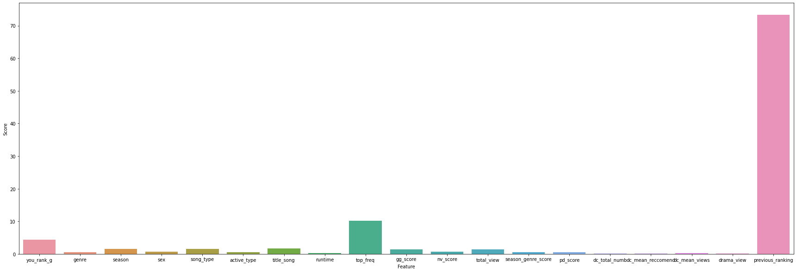

    
<a style="text-decoration:none">Contribution of Project</a>

    

- 문헌고찰 : [백원희](https://github.com/Wonhee-baek), [이청파](https://github.com/leechungpa)

- Crawling : [강동원](https://github.com/dw3624), [오태환](https://github.com/dhxoghks95), [유건욱](https://github.com/YooGunWook), [이청파](https://github.com/leechungpa)

- Preprocessing : [백원희](https://github.com/Wonhee-baek), [오태환](https://github.com/dhxoghks95), [이청파](https://github.com/leechungpa)

- EDA : [오태환](https://github.com/dhxoghks95)

- Modeling : [유건욱](https://github.com/YooGunWook), [오태환](https://github.com/dhxoghks95)

- Github 관리 : [유건욱](https://github.com/YooGunWook), [이청파](https://github.com/leechungpa)

- 중간발표자료 Rmd(presentation) : [백원희](https://github.com/Wonhee-baek)

- 최종발표자료 RMD(html) : [유건욱](https://github.com/YooGunWook), [오태환](https://github.com/dhxoghks95), [이청파](https://github.com/leechungpa)

- Shiny Visualizaiton : [강동원](https://github.com/dw3624)
    

 

# Introduction of Project

2019년 발표된 문화체육관광부의 자료에 따르면 음악 산업 시장은 2016년부터 2018년까지 꾸준하게 매출액이 증가하고 있다. 실제로 음원 시장에서 다양한 부가 가치가 창출 되고 '해외 진출에 따른 발전 가능성도 커질 것으로'(추승엽 외,2016) 기대된다. 그중에서도 성장하는 음원시장의 주요 지표로 음원 순위가 주목되고 있다. 따라서 음원 순위를 예측하는 것만으로도 상당한 유의미한 정보가 될 것이다. 그래서 우리는 다음을 목표로 정하였다.

 

 **음원 데이터를 활용한 주간음원순위 예측** 

 

## 작업 흐름도

 
 

# Crawling

음원 시장은 시대의 특성이 반영되며 기존의 음반 산업과 다르게 '다양한 변수에 의해 영향을 받는 시장'(추승엽 외, 2016)으로 변화 하고 있다. 특히 변화하는 트랜드에 따라 '음원 시장은 유투브, SNS, 인터넷 사이트 등 다양한 플랫폼의 영향이 커지고'(김가연 외, 2018) 있다. 따라서 우리는 선행논문들을 참고하여 다음의 사이트에서 제공되는 데이터를 활용해 주간음원순위를 예측해 보고자 한다.

- [가온차트](http://www.gaonchart.co.kr/main/section/chart/online.gaon?nationGbn=T&serviceGbn=ALL) : 주간 가온차트 순위

- [지니](https://genie.co.kr/chart/top200) : 곡명, 가수명에 따른 곡 정보(장르, ost유무, 가수 성별, 등)

- [유튜브 Music Charts & Insights](https://charts.youtube.com/?hl=ko) : 주간 순위권 뮤직비디오 조회수

- [DC갤러리 연애/방송](https://enter.dcinside.com/) : 가수명에 따른 갤러리별 조회수, 게시글수, 추천수

- [구글 트렌드](https://trends.google.co.kr/trends/?geo=KR) : 가수명에 따른 구글 트렌드

- [네이버 데이터랩](https://datalab.naver.com/) : 가수명에 따른 네이버 트렌드

- [Nielsen코리아](https://www.nielsenkorea.co.kr/tv_terrestrial_day.asp?menu=Tit_1&sub_menu=1_1&area=01) : OST 프로그램에 따른 지상파, 종합편성, 케이블 일일 순위 데이터 

이상 7개의 사이트의 정보 중 **2018년 4월 이후**의 데이터를 크롤링하였다. 해당 일을 기준일로 한 이유는 유튜브 데이터가 그 시점 부터 제공되었기 때문이다. 

## 사용한 변수

우리가 예측하고자 하는 *주간 순위*는 가온주간차트에서 뽑은 데이터이다. 이외에도 예측하기 위한 다양한 데이터를 뽑고 모형에 만들기 위해 전처리 하였다. 예를 들어 DC데이터의 경우 갤럴리명(가수명)별로 주간 기준에 따라 분류 후, 조회수는 단순 합을, 게시글수와 추천수는 평균낸 값을 사용하였다. 이렇게 다양한 사이트를 통해 얻은 데이터를 **기간**(주를 단위로 매주 일요일부터 토요일까지), **곡명**, **가수명**를 key로 합쳤다. 

아래는 우리가 모형에 사용하고자 하는 데이터들의 변수 정보를 정리한 표이다. 

| 변수명 | 변수의 의미 | 출처 |
| :----: | :---------- | :--- |
|rank|주간 곡 순위|가온차트|
|week|해당 차트의 주|가온차트|
|artist|가수명|가온차트|
|name|곡명|가온차트|
|st_day|해당 차트의 주, train, test데이터 분할에 사용|가온차트|
|genre|노래 장르|지니|
|sex|가수 성별|지니|
|song_type|음악종류|지니|
|active_type|가수유형 (예 : 그룹, 솔로)|지니|
|runtime|음악 재생 시간 (단위 : 초)|지니|
|you_rank_g|10구간화한 유튜브 순위|유튜브|
|total_view|총 유튜브 시청수|유튜브|
|gg_score|가수별 주간 구글 트렌드 지수|구글 트렌드|
|nv_score|가수별 주간 네이버 트렌드 지수|네이버 데이터랩|
|pd_score|소속사 네이버 트렌드 지수|네이버 데이터랩|
|dc_total_numb|가수별 주간 게시물 총수|DC 갤러리|
|dc_mean_recommend|가수별 주간 평균 추천수|DC 갤러리|
|dc_mean_views|가수별 주간 평균 조회수|DC 갤러리|
|drama_view|OST곡일 경우 해당프로그램 시청률|Nielsen코리아|
|top_freq|100위 안에 가수가 얼마나 많이 차트에 곡을 올렸는지 4분위수|파생변수|
|title_song|각 주차별 동일가수의 곡 중 가장 높은 순위가 True, 나머지가 False|파생변수|
|previous_ranking|신곡의 경우 해당 가수의 이전곡의 마지막 순위, 기존에 있는 경우 전주차 순위|파생변수|
|season|계절|파생변수|
|season_genre_score|(장르&계절별 평균rank_g - 장르별 평균rank_g) / (장르별 평균rank_g)|파생변수|

다음의 링크를 통해 scale 전의 raw 데이터를 볼 수 있다. 검색을 통해 그 값들을 확인해 볼 수 있다. 

 

 [Raw data table](https://yoogunwook.github.io/1nurse4stat/table.html) 

 

 

# Preprocessing with EDA

모형을 분석하기 전 EDA를 실시하였고, 예측의 정확도를 높이기 위해 파생변수를 만들었다. 그중 가장 중요한 파생변수는 *previous_ranking*로 이전 곡 순위를 의미하는 변수이다. 이외에도 여러 파생변수를 만들었으며 scale을 하였다. 자세한 과정은 다음의 링크를 통해 확인 가능하다.

 

 [자세한 Preprocessing with EDA](https://yoogunwook.github.io/1nurse4stat/EDA_Preprocessing.html) 

 

- 파생변수 생성

    - title_song : 높은 인기로 인해 음원차트에 2곡 이상의 곡을 진입시킨 가수들이 있다. 타이틀곡이 아닌 곡의 경우에는 가수의 다른 지표가 좋아도 타이틀곡에 비해 순위가 낮을 수 밖에 없다. 따라서 그 주차에 한 가수가 진입시킨 곡들 중에 가장 순위가 높은 곡을 title_song이라고 정하고 title_song인 경우는 TRUE, 아닌 경우는 FALSE를 할당하는 변수를 만들었다.

    - previous_ranking : 당연히 음원차트 순위 예측은 이전 순위에 영향을 받을 것이다. 따라서 기존에 차트에 있는 곡은 이전주차 순위를, 신곡의 경우는 그 가수가 직전에 낸 음반의 title_song의 rank_g중 가장 높은(1에 가까운) 순위를 할당하였다.

    - top_freq 생성 : 음원 중엔 소위 "연금"이라고 불리는 곡들이 있다. 장기간 차트에 진입했다는 것을 의미한다. 우리는 그러한 오랜 기간 사랑받은 곡을 판별하기 위해 이러한 변수를 만들었다. 그 곡이 Top 100에 얼마나 많이 올렸는지를 세어 4그룹으로 나누었다.

    - season_genre_score 생성 : 가을 겨울엔 발라드, 여름엔 댄스. 보통 사람들의 인식 속에 계절별로 인기있는 장르가 다르다. 실제로도 그런 경향이 있는지 확인하고 싶었다.

- scaling

    - log transformation : Transformation for skewed data

    - Min-Max Scaling

 
 

# Modeling

우리는 총 4가지의 모델을 사용하였고 그 중 가장 최적의 모델을 찾아 우리의 최종 모형을 사용하고자 하였다. 4가지 모델로 Logistic regression, Random forest. XG boost, Cat boost를 사용하였다. 모델 비교의 지표로 RMSE를 사용하였다. 그 결과 XG boost가 가장 좋은 결과를 보였다.자세한 과정은 다음의 링크를 통해 확인 가능하다.

 

 [자세한 Modeling](https://yoogunwook.github.io/1nurse4stat/modeling.html) 

 

|Model|Valid RMSE|Test RMSE|
|:--:|:--:|:--:|
|LinearRegression|21.009|21.325|
|RandomForest|18.771|21.330|
|CatBoost|20.827|22.286|
|XGBoost|18.640|21.16875|

 

 

# Shiny Visualization

이상의 결과에서 XGboost를 사용했을 때 가장 낮은 RMSE를 보였다. 이 모형을 우리의 최종 예측모형으로 정하고,`Shiny` 패키지를 이용해 반응형 웹을 구현하였다. 해당 대쉬보드는 두 개의 웹페이지로 이루어져 있다. 다음의 링크를 통해 우리의 모형을 직접 예측을 해볼 수 있다.

 

 [Shiny Dashboard](https://dw3624.shinyapps.io/shiny_desaip/) 

 

   * Ranking  Fluctuation
      * Table Tab : artist, name, week, diff_rank를 포함한 datatable
      * Graph Tab : 특정 곡의 과거 5주간 차트 실제 및 예측 변화 추이를 출력.
         *  Real Rank : 푸른 선으로 표시, 실제 순위 변화 추이를 출력.
         *  Rank Estimate : 주황 점선으로 표시, 예측 순위 변화 추이를 출력.
         *  Value Box : 하단의 5개 valuebox는 각각 과거 5주간의 예측 순위와 실제 순위 차이를 출력 및 평가. 차이가 20 미만의 경우 초록, 20이상 70미만의 경우 주황, 70이상의 경우 빨강.

   * Data Table
 사용한 datatable 제시. 가독성을 위해 일부 변수 생략. 

      * artist: 가수명
      * name: 곡명
      * title_song: 각 주차별 해당 가수 곡 중 최고 순위 여부
      * week: 해당 차트 주
      * top_freq: 100위 안에 가수가 얼마나 많이 차트에 곡을 올렸는지 4분위수
      * rank: 주간 곡 순위
      * rank_g_pred: 주간 곡 예측 순위
      * diff_rank: 주간 곡 실제 순위와 예측 순위의 차이

 

 

# Result

## 결과 분석

변수 중요도를 분석하였다. 모든 모형 모두 *previous_ranking*의 영향을 많이 받는 것을 알 수 있다. 그 다음으로 *top_freq* 등이 높은 중요도를 보임을 알 수 있다.

 

 

 

특히 가장 낮은 RMSE를 보인 XGboost의 경우, *previous_ranking*이 20개의 범주로 구성되어 있어 one-hot encoding 되어 있기에 상대적으로 다른 변수 중요도가 높은 것을 볼 수 있다. 즉 *top-freq*, *nv_score*, *runtime*, *gg_score*, *pd_score*, *total_view* 등이 높은 것을 확인할 수 있다.

 

 

이처럼 가장 낮은 RMSE를 보인 XGboost 모형을 이용하여 각각의 변수별로 주간 순위를 예측할 수 있을 것이다.

우리가 사용한 모델을 더욱 정교화 한다면 더욱 중요되고 있는 음원시장에서 마케팅 목적 등에 활용할 수 있다. 또한 국내 시장 뿐만 아니라 비슷한 해외 시장 데이터를 바탕으로 해외 음원가수 예측 모형모형을 만드는데 참고할 수 있을 것이다.

## 제한점 및 추후 보완점

- 크롤링의 제한 : DC 등 일부 data의 NA가 너무 많았다. 또한 활용하지 못한 데이터도 있다.

- 신인의 경우 : 과거 순위가 없는 경우 오차가 높게 나온다.

- outlier를 분명하게 구별하는 모델을 보완해야 할 것이다.

- 데이터 크롤링을 실시간으로 만들어 shiny를 구현한다면, 변수를 전부 입력하는 수고를 줄이는 user-based dashboad를 구현 가능하다.

 

 

# References

- [곽아영 (2017) 데이터 분석을 통한 온라인 음원차트의 어뷰징 영향요인 탐색](http://www.riss.kr/search/detail/DetailView.do?p_mat_type=be54d9b8bc7cdb09&control_no=96155f174d1eb757ffe0bdc3ef48d419&outLink=K)

- [정종범 (2019) 디지털 음원 시장의 현황 분석](http://www.riss.kr/search/detail/DetailView.do?p_mat_type=be54d9b8bc7cdb09&control_no=b8a6efe3d585b804ffe0bdc3ef48d419)

- [추승엽, 현창민, 임성준 (2016) 디지털 음원산업의 흥행요인.Korea Business Review,20(4),231-254.](http://www.dbpia.co.kr/journal/articleDetail?nodeId=NODE07060997)

- [김가연, 김명준 (2018) 소셜 데이터 분석을 통한 음원 흥행 예측 지표 연구. 한국디지털콘텐츠학회 논문지, 19(6), 1105-1114](http://www.dbpia.co.kr/journal/articleDetail?nodeId=NODE07478981)

- [Chon, Song Hui (2006) Predicting success from music sales data: a statistical and adaptive approach](https://www.researchgate.net/publication/228427644_Predicting_success_from_music_sales_data_a_statistical_and_adaptive_approach)

- [하정철, 강동훈, 박재모, 길준민 (2016) R 기반의 빅데이터 기술을 활용한 뉴스기사와 음원차트의 상관관계 분석](https://doi.org/10.3745/PKIPS.y2016m10a.636)

- [문화체육관광부 (2019) 콘텐츠산업 통계조사](http://www.kocca.kr/cop/bbs/view/B0158948/1842396.do;KCSESSIONID=Y8v0pcCbZ2Z01361v8NNvPJ2WVK4y3QKyLDDYwvzr2yykJJqyyQ6!1977949012!702860807?searchCnd=&searchWrd=&cateTp1=&cateTp2=&useAt=&menuNo=203778&categorys=0&subcate=0&cateCode=&type=&instNo=0&questionTp=&uf_Setting=&recovery=&option1=&option2=&year=&categoryCOM062=&categoryCOM063=&categoryCOM208=&categoryInst=&morePage=&delCode=0&qtp=&pageIndex=1)

- [Jiyun Chung, Myoung Jun Kim (2018) Music recommendation model by analysis of listener's musical preference factor of K-pop](https://dl.acm.org/doi/10.1145/3209914.3209932)

